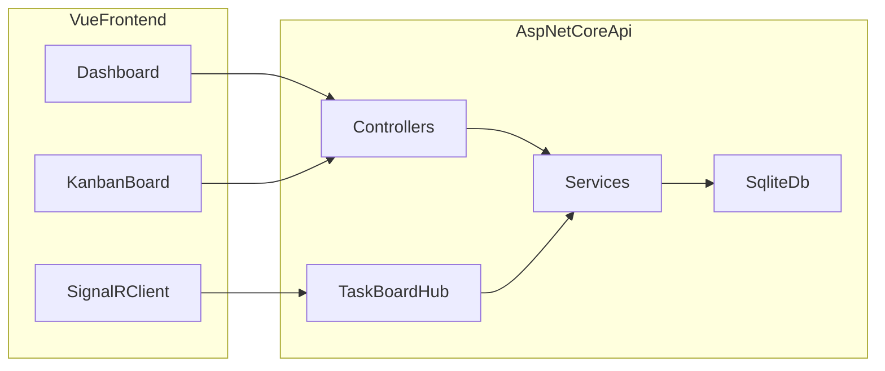

# TaskFlow

TaskFlow is an interview-ready collaborative project tracker built with **Vue 3 + TypeScript** on the frontend and **ASP.NET Core 10** on the backend.

## Highlights

- JWT-authenticated REST API with EF Core and SQLite
- Responsive dashboard and touch-friendly Kanban board
- Optimistic task moves with version-based conflict detection
- SignalR live board, activity feed, and analytics refresh
- Automated backend integration tests and frontend unit tests

## Architecture



## Prerequisites

- [.NET SDK 10+](https://dotnet.microsoft.com/download)
- [Node.js 22+](https://nodejs.org/)
- GitHub CLI (`gh`) if you want to recreate the remote repository locally

## Quick start

### 1. Backend

```bash
cd backend/TaskFlow.Api
dotnet run
```

API runs at `http://localhost:5080`.

### 2. Frontend

```bash
cd frontend
npm install
npm run dev
```

App runs at `http://localhost:5173` and proxies API calls to the backend.

## Demo credentials

| User | Email | Password |
|------|-------|----------|
| Alice Chen | `alice@taskflow.dev` | `Password123!` |
| Bob Rivera | `bob@taskflow.dev` | `Password123!` |

A seeded **Product Launch** project with sample tasks is created on first run.

## Feature overview

### Core
- Sign in with JWT
- Project list and project creation
- Task CRUD with status, priority, assignee, due date, and labels
- Search and filter tasks

### Advanced
- Drag-and-drop Kanban with optimistic updates
- Conflict-safe task versioning when collaborators edit concurrently
- Real-time task, activity, and analytics updates through SignalR
- Project analytics: status distribution, overdue count, completion trend

### Responsive UX
- Mobile navigation drawer
- Horizontally scrollable Kanban on tablet/mobile
- Accessible forms, buttons, and keyboard task selection

## API endpoints

| Method | Endpoint | Description |
|--------|----------|-------------|
| `POST` | `/api/auth/login` | Authenticate user |
| `GET` | `/api/auth/me` | Current user profile |
| `GET` | `/api/projects` | List accessible projects |
| `POST` | `/api/projects` | Create project |
| `GET` | `/api/projects/{id}/tasks` | List/filter tasks |
| `PATCH` | `/api/projects/{id}/tasks/{taskId}/move` | Move task with version check |
| `GET` | `/api/projects/{id}/activities` | Activity feed |
| `GET` | `/api/projects/{id}/analytics` | Project analytics |
| Hub | `/hubs/taskboard` | SignalR collaboration channel |

OpenAPI is available in development at `/openapi/v1.json`.

## Testing

```bash
dotnet test backend/TaskFlow.Api.Tests/TaskFlow.Api.Tests.csproj
cd frontend
npm test
npm run build
```

## Interview talking points

1. **Clean separation**: domain entities, DTOs, services, and controllers
2. **Security**: JWT auth, project membership checks, centralized exception handling
3. **Collaboration**: optimistic UI + version checks + SignalR broadcast
4. **Production awareness**: migrations, seed data, CORS, validation, tests, responsive UI
5. **Incremental delivery**: scaffold → API → UI → realtime → tests/docs

## Repository commits

This project was published in focused steps:

1. `chore: scaffold TaskFlow frontend and API`
2. `feat: add authenticated project and task API`
3. `feat: build responsive dashboard and Kanban board`
4. `feat: add real-time collaboration and analytics`
5. `test: cover core workflows and document the project`

## Configuration

Backend settings live in [`backend/TaskFlow.Api/appsettings.json`](backend/TaskFlow.Api/appsettings.json).

For local development, update the JWT signing key before deploying to production.

## License

MIT
